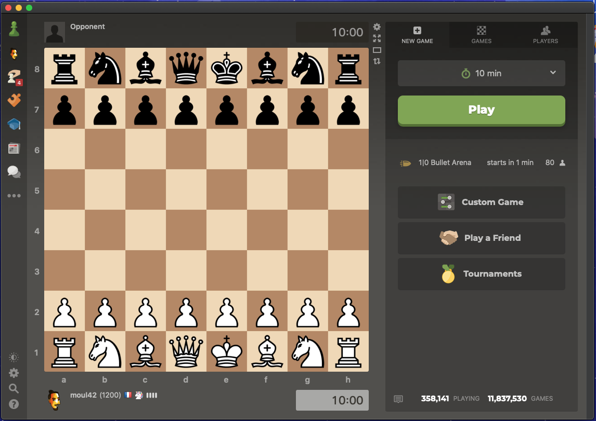

# macos-chess-com
♟ macOS app for chess.com/@ChessCom (unofficial)

A simple app that replaces your browser to play chess.com on your Mac.

This app is a simple WebView (native app equivalent of iframe), it allows me to easily have a dedicated app on my Dock.

I would like to add notifications support with a badge number on the Dock icon and maybe inject some js/css to make the webapp looking a little bit more like a Desktop app.

